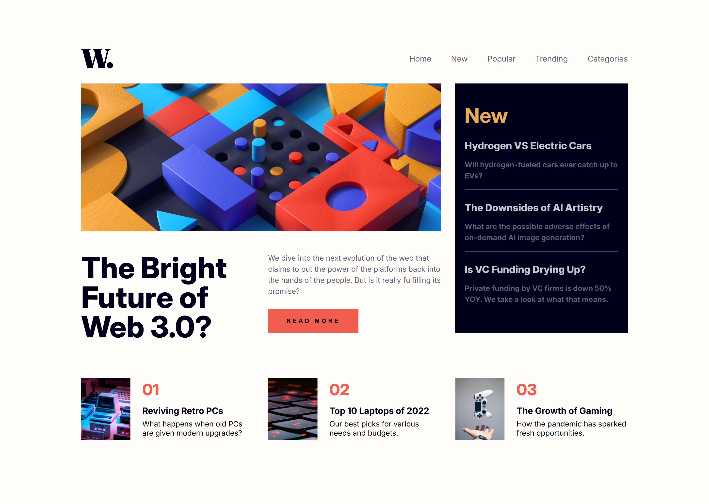

# Frontend Mentor - News homepage solution

This is a solution to the [News homepage challenge on Frontend Mentor](https://www.frontendmentor.io/challenges/news-homepage-H6SWTa1MFl). Frontend Mentor challenges help you improve your coding skills by building realistic projects.

## Table of contents

- [Overview](#overview)
  - [The challenge](#the-challenge)
  - [Screenshot](#screenshot)
  - [Links](#links)
- [My process](#my-process)
  - [Built with](#built-with)
  - [What I learned](#what-i-learned)
  - [Continued development](#continued-development)
  - [Useful resources](#useful-resources)
- [Author](#author)
- [Acknowledgments](#acknowledgments)

**Note: Delete this note and update the table of contents based on what sections you keep.**

## Overview

### The challenge

Users should be able to:

- View the optimal layout for the interface depending on their device's screen size
- See hover and focus states for all interactive elements on the page

### Screenshot



### Links

- Solution URL: [Add solution URL here](https://your-solution-url.com)
- Live Site URL: [Add live site URL here](https://your-live-site-url.com)

## My process

### Built with

- Semantic HTML5 markup
- CSS custom properties
- Flexbox
- CSS Grid
- Mobile-first workflow

**Note: These are just examples. Delete this note and replace the list above with your own choices**

### What I learned

Accessibility is pretty hard I had a hard time understanding when and where to use it.
Overall I stuck to using semantic html, I made my best effort to name things accordingly, and use aria-roles or labels where it made sense to me.
I kept it as simple and clear as I saw correct after all the article did state “No ARIA is better than bad ARIA”.

Proud of this snippet:

```js
menuIcon.addEventListener("click", () => {
  console.log("menu clicked");
  navbar.classList.toggle("active");

  if (navbar.classList.contains("active")) {
    menuIcon.src = "../assets/images/icon-menu-close.svg";
  } else {
    menuIcon.src = "../assets/images/icon-menu.svg";
  }
});
```

### Continued development

I'd love to become better at writing accessible code, I know this is a very necessary tool for many people.

### Useful resources

- [Grids Layout](https://developer.mozilla.org/en-US/docs/Web/CSS/grid-column) - From time to time I need a reminder of how grids and it's many parts work.
- [Aria Labeling ](https://developer.mozilla.org/en-US/blog/aria-accessibility-html-landmark-roles/) - Aria labelimg helpful info.
- [Accessibility Website ](https://www.w3.org/WAI/ARIA/apg/) - Aria labelimg and all you things related to it.

## Author

- Frontend Mentor - [@moncadad](https://www.frontendmentor.io/profile/moncadad)
